<!-- markdownlint-disable MD033 MD041 -->
<div align="center">

# 🏪 OceansTenant

**AI 連携を組み込んだ店舗物件検索プラットフォームのリファレンス実装**

[](https://github.com/OceansCreative/oceans-tenant-demo/actions/workflows/ci.yml)
[](https://github.com/OceansCreative/oceans-tenant-demo/actions/workflows/lighthouse.yml)
[](https://github.com/OceansCreative/oceans-tenant-demo/actions/workflows/codeql.yml)
[](https://codecov.io/gh/OceansCreative/oceans-tenant-demo)
[](https://github.com/OceansCreative/oceans-tenant-demo/actions/workflows/chromatic.yml)
[](https://github.com/OceansCreative/oceans-tenant-demo/actions/workflows/eval.yml)
[](https://github.com/OceansCreative/oceans-tenant-demo/releases)

[](LICENSE)
[](.nvmrc)
[](tsconfig.json)

</div>

物件 URL をペーストするだけで AI が情報を構造化抽出し、自然言語での対話型検索を可能にする
OSS リファレンス実装です。Next.js 15 / Sanity v3 / Anthropic Claude API / Tailwind CSS 4 で構成されています。

🔗 **デモ**: [demo.oceans-base.com/tenant-search](https://demo.oceans-base.com/tenant-search)

### 累積成果サマリ（v0.9.0 時点）

| 指標 | 値 |
|---|---|
| vitest（apps/web） | **470 ケース** pass |
| vitest（packages/shared） | **144 ケース** pass |
| node:test（scripts/eval） | **29 ケース** pass |
| Playwright E2E | **22 ケース** pass（locale 強制 + `/insights` a11y 含む） |
| apps/web カバレッジ Lines | **95.84%** |
| Lighthouse（5 URL × 3 ラン中央値） | 全カテゴリ **0.96+** |
| axe 違反（主要 5 ページ） | **0** |
| `/ship` 並列実装サイクル | **8 回**実施 |
| Workflow（リリースノート生成） | **3 回**実施 |
| 公開 Release タグ | **v0.1.0 → v0.9.0**（15 タグ） |

次の v1.0.0 では Sanity 実 PROJECT_ID 投入 / Vercel 実デプロイ公開 / TypeScript 6.x 等を完了させ、
**「公開リファレンス実装としての完成」** を達成予定です。詳細は [docs/ROADMAP.md](docs/ROADMAP.md) を参照してください。

---

## ✨ 特徴

- 🤖 **URL → 構造化抽出** — 物件掲載ページの URL を投げると、Cheerio + Mozilla Readability で本文抽出 → Claude API で JSON スキーマ抽出 → Zod 検証 → Sanity にドラフト保存
- 💬 **対話型検索** — 自然言語の条件から Claude が GROQ クエリを生成し、ホワイトリスト方式でインジェクション対策しながら Sanity を検索
- 🗺️ **地図ビュー** — Google Maps JavaScript API で物件をマップ表示、カード ⇄ 地図のビュー切替
- 📦 **Sanity Headless CMS** — Property / RealEstateCompany / BusinessCategory / Area / SearchSession の 5 ドキュメントタイプを Zod スキーマと 1:1 で運用
- ⚡ **Next.js 15 App Router** — Server Components / SSE ストリーミング / TypedRoutes
- 🎨 **Tailwind CSS v4** — oklch カラートークン / Noto Sans JP / モバイルファースト / a11y 配慮
- 🌐 **多言語対応（ja / en）** — `next-intl` + cookie ベースの locale 切替（v0.8.0 でフェーズ 1 として導入。Header / Footer / トップページが切替可能）
- 🐍 **Python 補助** — pydantic + faker でダミー物件 50 件を生成し Sanity にシード

## 🎬 操作デモ

<sub>Mock データと Playwright スクリプトで再現。実 API 鍵は不要。再生成は `pnpm screenshots:gif`。</sub>

### 物件を探す — フィルタ即時絞り込み

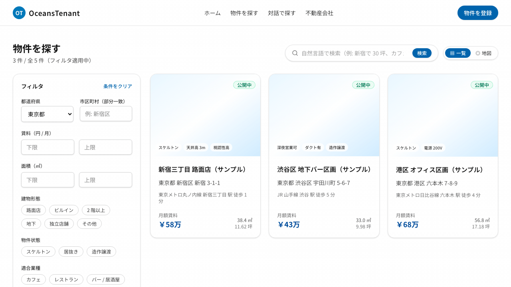

### 対話で物件を探す — 自然言語 → AI 抽出 → SSE 配信

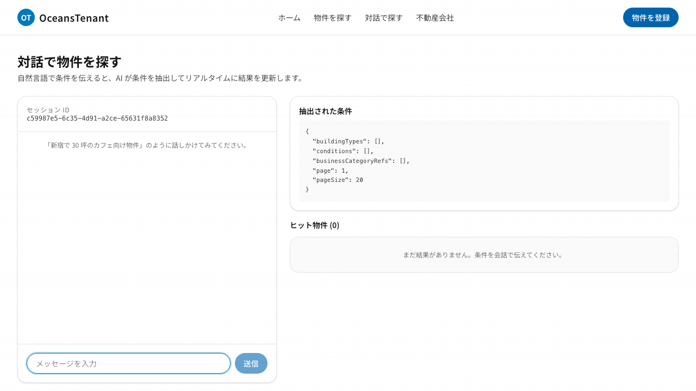

### URL から物件を取り込む — AI 構造化抽出

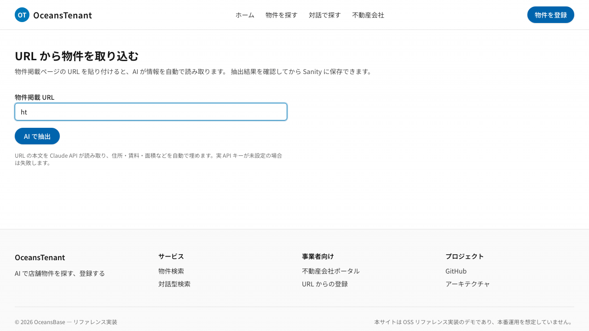

## 📸 スクリーンショット

<sub>Mock データのみ使用（実在企業・実在物件は含みません）。再生成は `pnpm screenshots`。</sub>

### ランディング

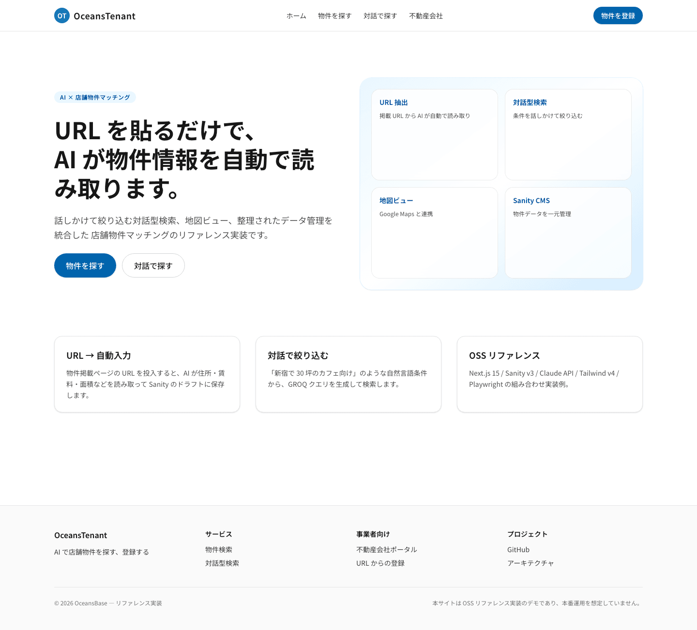

### 物件を探す（検索一覧）

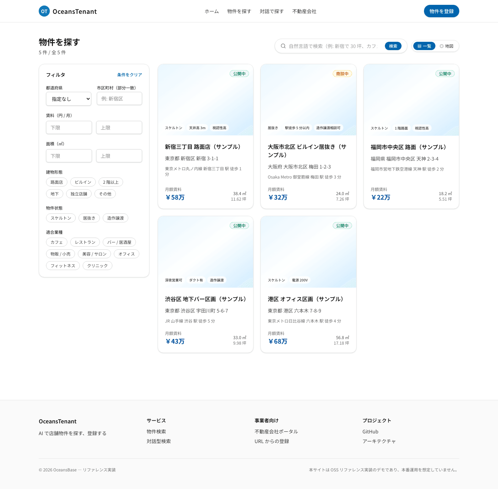

### 物件詳細

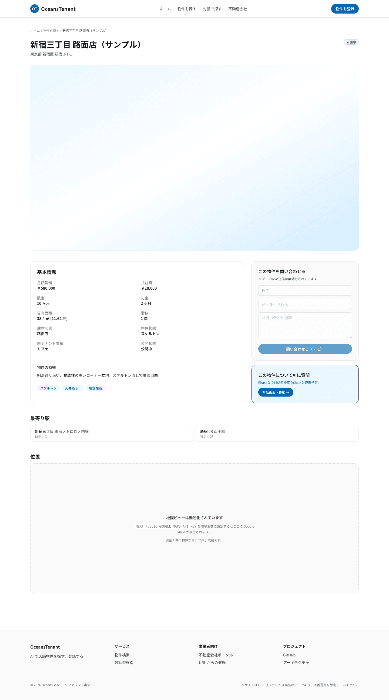

### 対話型検索

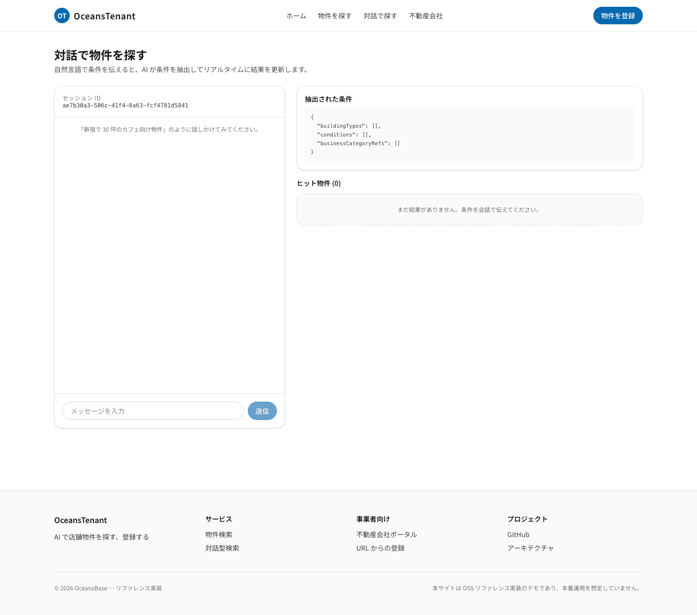

### 不動産会社ポータル

| ダッシュボード | URL 取り込み |
|---|---|
| 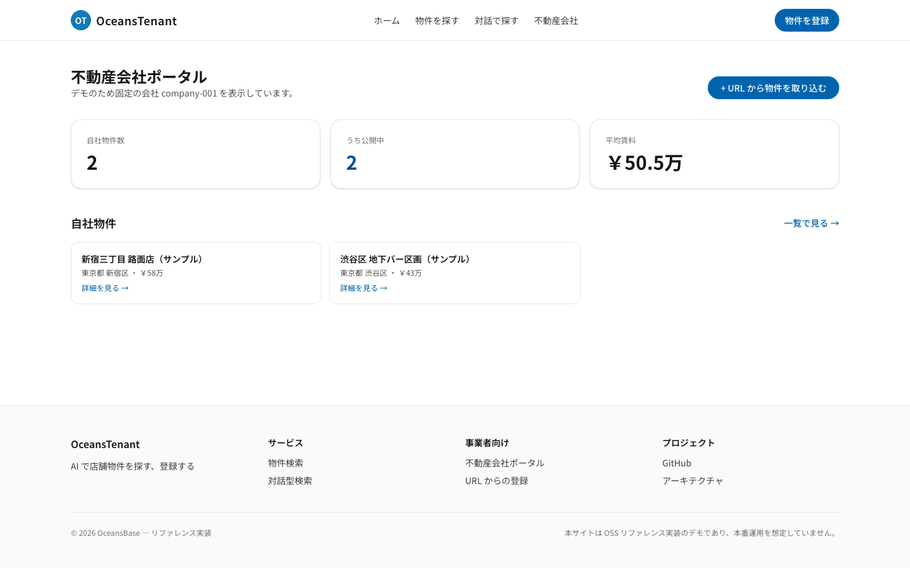 | 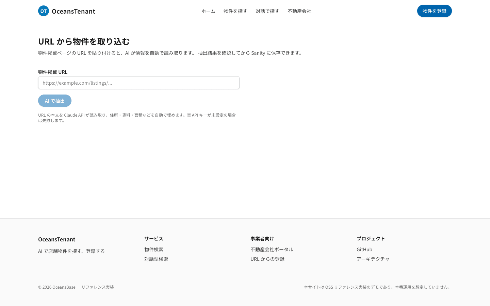 |

### モバイル表示

| ランディング | 検索 | 対話 |
|---|---|---|
| 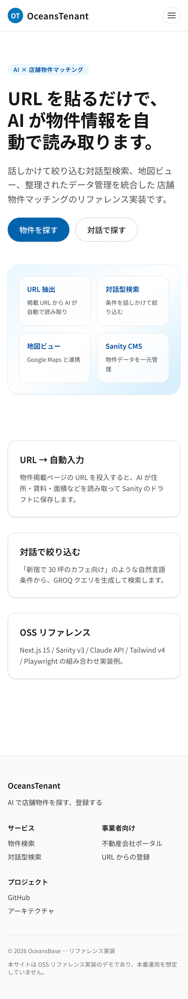 | 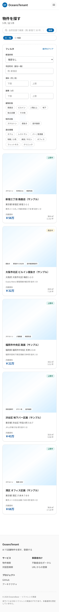 | 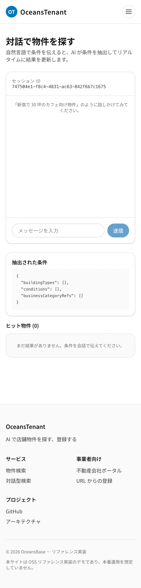 |

## 🏗️ アーキテクチャ

```text
              ┌──────────────────────────────────┐
              │  Next.js 15 App Router (Vercel) │
              │  ├─ /search    一覧 + 地図        │
              │  ├─ /chat      対話型検索 (SSE)    │
              │  ├─ /properties/[slug]            │
              │  ├─ /agent     不動産会社管理        │
              │  ├─ /studio    Sanity Studio 埋込み │
              │  └─ /api/*     API Routes         │
              └────┬───────────┬──────────┬──────┘
                   │           │          │
       Claude API ─┘     Sanity v3      Google Maps
       (構造化抽出 /     (Document /     (JS API)
        対話 / GROQ)      Reference /
                          GROQ)
```

詳細は [docs/ARCHITECTURE.md](docs/ARCHITECTURE.md) を参照。

## 🚀 Quick Start

依存さえ整っていれば、以下のブロックをそのまま貼るだけでローカル起動まで到達します。
`ANTHROPIC_API_KEY` を `.env.local` に入れれば AI 連携が、Sanity 環境変数を入れれば
GROQ 接続が有効化されます（いずれも未設定なら mock データで動作します）。

```bash
git clone https://github.com/OceansCreative/oceans-tenant-demo.git
cd oceans-tenant-demo
nvm use                                       # Node 20 LTS（.nvmrc）
corepack enable && corepack prepare pnpm@9.15.4 --activate
pnpm install
cp .env.example .env.local                    # ANTHROPIC_API_KEY を設定（Sanity 未設定なら mock fallback）
pnpm dev                                      # http://localhost:3000
```

### 前提条件

| ツール | バージョン |
|---|---|
| Node.js | 20.x LTS（`.nvmrc` で固定） |
| pnpm | 9.15.4（`packageManager` で固定） |
| Python | 3.12（`scripts/python/` でのみ使用） |

### 追加で動かせるもの

```bash
pnpm studio                                       # Sanity Studio (apps/studio)
pnpm --filter @oceans-tenant/web storybook        # Storybook UI カタログ（http://localhost:6006）
pnpm --filter @oceans-tenant/web build-storybook  # 静的 storybook-static/ を生成（Chromatic / CI 用）
pnpm screenshots                                  # スクリーンショット再撮影（Playwright）
pnpm screenshots:gif                              # 🎬 操作デモ GIF 再生成
```

### 環境変数

| 変数 | 必須 | 用途 |
|---|---|---|
| `NEXT_PUBLIC_SANITY_PROJECT_ID` | ✅ | Sanity プロジェクト ID |
| `NEXT_PUBLIC_SANITY_DATASET` | ✅ | Sanity データセット（`production`） |
| `SANITY_API_TOKEN` | ✅ | 書き込みトークン |
| `ANTHROPIC_API_KEY` | ✅ | Claude API キー |
| `ANTHROPIC_MODEL` | — | 既定 `claude-sonnet-4-5` |
| `NEXT_PUBLIC_GOOGLE_MAPS_API_KEY` | — | 未設定時は地図ビューを無効化 |
| `NEXT_PUBLIC_APP_URL` | — | OGP / canonical 用 |
| `NEXT_PUBLIC_ADMIN_ENABLED` | — | `true` 完全一致時のみ `/admin`（demo / 認証なし）を有効化 |

### ダミーデータの投入

```bash
cd scripts/python
python3 -m venv .venv && .venv/bin/pip install -r requirements.txt 'pydantic[email]'
.venv/bin/python seed_properties.py --count 50            # Sanity に 50 件投入
.venv/bin/python seed_properties.py --count 50 --dry-run  # 確認のみ
```

## 🧪 テスト

```bash
pnpm lint            # Biome
pnpm typecheck       # tsc --noEmit（全ワークスペース）
pnpm test            # Vitest + scripts/eval の node:test（全ワークスペース）
pnpm test:coverage   # カバレッジ付き（apps/web と packages/shared）

# E2E（Playwright、Phase 2 で導入）
pnpm --filter @oceans-tenant/web exec playwright test

# Python
cd scripts/python && .venv/bin/pytest --cov

# AI 抽出評価ハーネス（scripts/eval、v0.8.0 WS-2）
pnpm --filter oceans-tenant-eval run eval:mock   # API キー不要のスモーク実行
ANTHROPIC_API_KEY=sk-ant-... node scripts/eval/run.mjs  # 実 Claude で精度測定
```

CI（GitHub Actions）で以下が常時走ります:

- `ci.yml`: Lint / 型 / ユニットテスト / Python pytest / カバレッジ Codecov 連携
- `e2e.yml`: Playwright
- `codeql.yml`: JS/TS 静的解析

### カバレッジ

`pnpm test:coverage` でワークスペース毎に `coverage/lcov.info` と `coverage/coverage-summary.json`
が生成されます。CI では `apps/web` / `packages/shared` / `scripts/python` の 3 フラグで
[Codecov](https://codecov.io/gh/OceansCreative/oceans-tenant-demo) にアップロードされ、PR には
差分カバレッジのコメントが投稿されます。

| ワークスペース | フラグ | 計測対象 | 除外 |
|---|---|---|---|
| `apps/web` | `web` | `src/**/*.{ts,tsx}` | テスト本体 / `app/**/page.tsx` / `app/**/layout.tsx` / `app/og/**` / `sitemap.ts` / `robots.ts` |
| `packages/shared` | `shared` | `src/**/*.ts` | テスト本体 / `index.ts` |
| `scripts/python` | `python` | `scripts/python/**` | `tests/**` |

目標値（warning レベル運用、CI を fail させない設定）は次の通り。詳細は
[docs/REVIEW_GUIDE.md](docs/REVIEW_GUIDE.md) を参照。

| 指標 | 目標 |
|---|---|
| Lines / Statements | 70% |
| Branches | 65% |
| Functions | 70% |
| Patch（新規・変更行） | 70% |

## 🗂️ ディレクトリ構成

```text
oceans-tenant-demo/
├─ apps/
│  ├─ web/                # Next.js 15 App Router
│  └─ studio/             # Sanity Studio v3
├─ packages/
│  └─ shared/             # Zod スキーマ / 型 / GROQ
├─ scripts/
│  ├─ python/             # Sanity シード + ログ分析
│  └─ eval/               # AI 抽出評価ハーネス（v0.8.0 で導入）
├─ e2e/                   # Playwright（Phase 2 で導入）
├─ docs/
│  ├─ spec.md             # 仕様書
│  ├─ ARCHITECTURE.md
│  ├─ AI_INTEGRATION.md
│  ├─ ROADMAP.md          # v1.0.0 マイルストーン
│  ├─ MIGRATION.md        # 互換性ガイド
│  └─ images/             # スクリーンショット
└─ .github/               # workflows / templates
```

## 🛣️ Phase 進捗

OSS リファレンス実装としての成熟度を段階で公開しています。各 Phase の詳細は
[CHANGELOG.md](CHANGELOG.md) を参照してください。

| Phase | 状態 | サマリ |
|---|---|---|
| Phase 1: 基盤構築 | ✅ 完了 (v0.1.0) | pnpm モノレポ / Biome / CI / Sanity スキーマ 5 種 / Zod ミラー / Python シード |
| Phase 2: 検索体験 | ✅ 完了 (v0.1.0) | `/search` フィルタ + 地図切替 / 物件詳細 ISR / Playwright E2E |
| Phase 3: AI 機能 | ✅ 完了 (v0.1.0) | `/api/ingest-url` / `/api/chat-search` SSE / `/api/query-build` GROQ 決定論変換 |
| Phase 4: 仕上げ | ✅ 完了 (v0.1.0) | `/agent` ポータル / `vercel.json` / `OCEANS_BASEPATH` / DEPLOY.md / ARCHITECTURE.md |
| Phase 5: 品質強化 | ✅ 完了 (v0.1.1〜v0.3.0) | SSRF 多層防御 / Tool Use 移行 / NextStudio 埋込 / ページネーション / Lighthouse CI / スクショ |
| Phase 6: 公開・運用 | 🚧 進行中 (v0.4.0〜v0.9.0) | Sanity 実接続レイヤ / Vercel デプロイ手順 / GIF 操作デモ / Storybook + Chromatic / 関連物件 / next-intl（ja/en）/ AI 抽出評価ハーネス + CI 統合 / `/insights` 物件統計ダッシュボード |
| Phase 7: v1.0.0 リリース | 🎯 計画中 | Sanity 実 PROJECT_ID 投入 / Vercel 実デプロイ公開 / TypeScript 6.x / Upstash Redis 置換（詳細は [docs/ROADMAP.md](docs/ROADMAP.md)） |

## 📚 ドキュメント

| ドキュメント | 内容 |
|---|---|
| [docs/spec.md](docs/spec.md) | 仕様書（要件 / データモデル / API 契約 / 受け入れ基準） |
| [docs/ARCHITECTURE.md](docs/ARCHITECTURE.md) | 全体構成 / レイヤ図 / データフロー 3 ユースケース / 主要ライブラリ表 / セキュリティ要点 |
| [docs/AI_INTEGRATION.md](docs/AI_INTEGRATION.md) | Claude Tool Use 設計 / プロンプト / SSE / SSRF 防御 / 抽出評価ハーネスの詳細 |
| [docs/ROADMAP.md](docs/ROADMAP.md) | v1.0.0 マイルストーン / Done（v0.1.0〜v0.9.0）/ v1.x 構想（OSS スコープ境界） |
| [docs/MIGRATION.md](docs/MIGRATION.md) | バージョン間互換性ガイド / 環境変数履歴 / API スキーマ変更 / 既知の制約 |
| [scripts/eval/README.md](scripts/eval/README.md) | `extract_property` の Gold Standard 評価ハーネス（メトリクス / fixture 追加手順） |
| [docs/REVIEW_GUIDE.md](docs/REVIEW_GUIDE.md) | コードレビュー入口 / 着眼点 / よくある質問 |
| [docs/DEPLOYMENT.md](docs/DEPLOYMENT.md) | Vercel への初回接続手順（環境変数 / Region / Troubleshooting） |
| [docs/DEPLOY.md](docs/DEPLOY.md) | カスタムドメイン / `OCEANS_BASEPATH` 等のアプリ固有デプロイ運用 |
| [CHANGELOG.md](CHANGELOG.md) | 全リリース履歴（Keep a Changelog 準拠、v0.1.0〜v0.9.0 + Unreleased） |
| [CONTRIBUTING.md](CONTRIBUTING.md) | 開発フロー / `/ship` パターン / 翻訳キー追加手順 / 品質ゲート |
| [SECURITY.md](SECURITY.md) | 脆弱性報告手順 / SLA / 過去の対応事例 |
| [CODE_OF_CONDUCT.md](CODE_OF_CONDUCT.md) | 行動規範（Contributor Covenant v2.1） |
| [CLAUDE.md](CLAUDE.md) | Claude Code 開発規約（プロジェクト原則 / 禁止事項） |

## 🤝 コントリビュート

[CONTRIBUTING.md](CONTRIBUTING.md) を参照してください。Issue とプルリクエストを歓迎します。

## 📄 ライセンス

MIT License © 2026 OceansBase — [LICENSE](LICENSE) 全文

---

<div align="center">

リファレンス実装としての完成度を保つため、本リポジトリには<br />
クライアント情報・営業文脈・実在企業名・実在物件情報は含まれていません。

</div>
