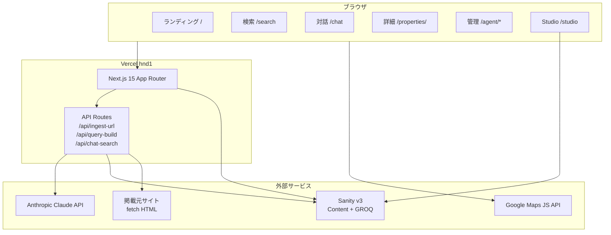

# アーキテクチャ

OceansTenant の全体構成と責務分担をまとめます。詳細仕様は [spec.md](spec.md) を、AI 連携は [AI_INTEGRATION.md](AI_INTEGRATION.md) を参照してください。

## 全体図



## レイヤ構成

```text
oceans-tenant-demo/
├─ apps/
│  ├─ web/               # Next.js 15 (App Router)
│  │  ├─ src/
│  │  │  ├─ app/         # ルーティング（Server Components）
│  │  │  │  ├─ api/      # API Routes（Node.js runtime）
│  │  │  │  ├─ search/, properties/[slug]/, chat/, agent/*, studio/[[...tool]]/
│  │  │  ├─ components/  # UI（property / search / map / chat / agent / layout）
│  │  │  ├─ lib/         # 純粋ロジック（format / search-criteria / filter / ai / uuid）
│  │  │  └─ styles/      # globals.css (Tailwind v4)
│  │  ├─ tests/          # Vitest + Testing Library
│  │  └─ playwright.config.ts
│  └─ studio/            # Sanity Studio v3
│     └─ schemas/        # property / realEstateCompany / businessCategory / area / searchSession
├─ packages/
│  └─ shared/            # 共有 Zod スキーマ + 型（apps/web と apps/studio 両方で使用）
│     └─ src/
│        ├─ property/    # Address / NearestStation / enums / propertySchema
│        ├─ realEstateCompany/
│        ├─ businessCategory/
│        ├─ area/
│        ├─ searchSession/
│        └─ tsubo.ts
├─ scripts/
│  └─ python/            # Pydantic + Faker でダミーデータ生成、pandas/matplotlib で分析
├─ e2e/                  # Playwright spec
├─ docs/
└─ .github/              # workflows / templates / dependabot
```

## データフロー

### URL 投入による物件登録（AI 抽出）

1. ユーザーが `/agent/ingest` に URL を投入
2. `/api/ingest-url` が掲載元 HTML を取得（Bot UA、12s タイムアウト）
3. Mozilla Readability + Cheerio で本文抽出
4. Claude `messages.create` で JSON 抽出（spec §6.1 互換）
5. Zod (`propertySchema`) で検証 → 失敗時 422
6. `derivePropertyTsubo` で坪換算
7. クライアントにプレビュー返却（Sanity 保存は別ステップ想定）

### 対話型検索（SSE ストリーミング）

1. クライアントが UUID v4 を URL クエリで保持（localStorage 禁止）
2. メッセージ送信時に `/api/chat-search` を POST
3. Claude が直近メッセージから `extractedCriteria` を JSON で返答
4. 決定論的に `filterProperties()` で結果を絞り込み（Phase 3 では mock、将来 GROQ）
5. SSE で `criteria` / `message` / `results` / `done` を逐次配信
6. クライアントが受信して履歴・抽出条件・結果カードを更新

### GROQ 生成（決定論変換）

`/api/query-build` は Claude を介さず、ホワイトリストで `SearchCriteria → GROQ` を変換します。
これによりインジェクションを完全に排除しつつ、AI レイヤから安全に呼び出せます。

## スキーマ間の参照関係

```mermaid
erDiagram
  property }o--|| realEstateCompany : listedBy
  property }o--o{ businessCategory : suitableBusinesses
  property }o--o{ area : (検索ファセット)
  businessCategory ||--o| businessCategory : parent
  area ||--o| area : parentArea
  searchSession }o--o{ property : resultProperties
  searchSession }o--o{ businessCategory : extractedCriteria.businessCategoryRefs
```

## 状態管理の方針

- **URL がアプリ状態の真実**: 検索条件は `?prefecture=...&...`、対話セッションは `?sessionId=...`
- **localStorage / sessionStorage 禁止**（CLAUDE.md / spec §13）
- **Server Component 優先**: できる限り Server で fetch・GROQ・filter を完結
- **`useTransition` で URL 更新**: フィルタ変更時に画面が固まらないよう非同期更新

## セキュリティ

- API キーは Vercel 環境変数のみ。コードベースには `.env.example` のみ
- pre-commit で Biome / commit-msg で commitlint
- CodeQL（週次 + PR）
- Dependabot（週次、pnpm/pip/github-actions）
- Security Advisories は `SECURITY.md` を参照

## 国際化

現状は日本語のみ。`<html lang="ja">` 固定。将来 `next-intl` を検討。

## アクセシビリティ

- Lighthouse Accessibility 95+ を目標
- ランドマーク要素（`<header>`, `<main>`, `<nav>`, `<footer>`, `<section>`, `<search>`）
- フォーム要素には `aria-label`、ボタン群には `aria-pressed`
- skip link、focus-visible スタイル

## 観測性

| 項目 | 手段 |
|---|---|
| ランタイムログ | Vercel Logs |
| エラー | 将来 Sentry を検討 |
| アクセス | Vercel Analytics（任意） |
| CI 健全性 | GitHub Actions の workflow ダッシュボード |
| カバレッジ | Codecov（web / shared / python flags 別） |

## パフォーマンス

- App Router + Server Components → 初回 HTML が軽量
- 物件詳細は `revalidate = 60` の ISR
- 画像は Sanity の CDN を `remotePatterns` で許可
- Tailwind v4 + Noto Sans JP `display: swap`
- Lighthouse Performance 90+（目標）

## 拡張ポイント

- Sanity Studio 埋め込み: `next-sanity` の `NextStudio` を `/studio` に統合
- 認証: 現状なし。導入する場合は NextAuth ではなく Clerk / WorkOS を推奨
- 全文検索: Sanity の検索が不十分なら Algolia / Meilisearch を別レイヤで
- Tool Use: Claude の Tool Use 機能で `propertySchema` を JSON Schema として渡す
