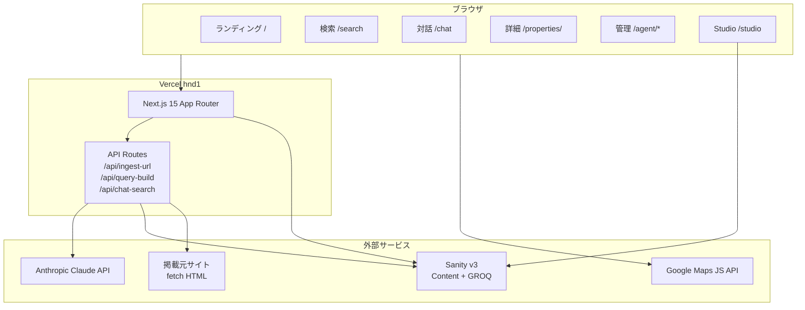

# アーキテクチャ

OceansTenant の全体構成と責務分担をまとめます。初見訪問者が「どのレイヤで何が起き、
どの境界で型・セキュリティ・AI が守られているか」を最短で把握できるよう、レイヤ図 →
データフロー → 主要ライブラリ → セキュリティ → ディレクトリ構成の順で構成しています。
詳細仕様は [spec.md](spec.md) を、AI 連携の深掘りは [AI_INTEGRATION.md](AI_INTEGRATION.md)、
セットアップは README の [Quick Start](../README.md#-quick-start) を参照してください。

## レイヤ図（テキスト版）

```text
[ User Browser ]
      |
      v
[ Next.js 15 (App Router, RSC) ── apps/web ]
   ├── /search          ─→ filter-properties (mock or Sanity)
   ├── /chat            ─→ /api/chat-search (SSE + Tool Use)
   ├── /ingest          ─→ /api/ingest-url (SSRF defense + Tool Use)
   └── /studio          ─→ NextStudio (apps/studio)
      |
      v
[ Anthropic Claude API ]   [ Sanity (env 切替) ]   [ Python seed scripts ]
```

- `apps/web` は Server Components 優先で、フィルタリング・GROQ 組み立て・SSRF 検証・
  Claude 呼び出しはすべてサーバ側で完結する（クライアント直叩き禁止 / `CLAUDE.md`）。
- Sanity 接続は `apps/web/src/lib/sanity/client.ts` の `fetchProperties` が
  `NEXT_PUBLIC_SANITY_PROJECT_ID` の有無で **mock データ ⇄ 実 GROQ** を切り替える
  （v0.4.0 / WS-2）。実 key 無しでも mock データで全画面が動作する。

## 全体図



## レイヤ構成

```text
oceans-tenant-demo/
├─ apps/
│  ├─ web/               # Next.js 15 (App Router)
│  │  ├─ src/
│  │  │  ├─ app/         # ルーティング（Server Components）
│  │  │  │  ├─ api/      # API Routes（Node.js runtime）
│  │  │  │  ├─ search/, properties/[slug]/, chat/, agent/*, studio/[[...tool]]/
│  │  │  ├─ components/  # UI（property / search / map / chat / agent / layout）
│  │  │  ├─ lib/         # 純粋ロジック（format / search-criteria / filter / ai / uuid）
│  │  │  └─ styles/      # globals.css (Tailwind v4)
│  │  ├─ tests/          # Vitest + Testing Library
│  │  └─ playwright.config.ts
│  └─ studio/            # Sanity Studio v3
│     └─ schemas/        # property / realEstateCompany / businessCategory / area / searchSession
├─ packages/
│  └─ shared/            # 共有 Zod スキーマ + 型（apps/web と apps/studio 両方で使用）
│     └─ src/
│        ├─ property/    # Address / NearestStation / enums / propertySchema
│        ├─ realEstateCompany/
│        ├─ businessCategory/
│        ├─ area/
│        ├─ searchSession/
│        └─ tsubo.ts
├─ scripts/
│  └─ python/            # Pydantic + Faker でダミーデータ生成、pandas/matplotlib で分析
├─ e2e/                  # Playwright spec
├─ docs/
└─ .github/              # workflows / templates / dependabot
```

## データフロー（3 ユースケース）

OceansTenant の中核 UX は **検索 / 対話 / 取り込み** の 3 つに集約できます。
それぞれが「URL ↔ 状態」「Server Components ↔ API Routes」「Zod ↔ Claude Tool Use」の
3 つの境界をどう跨ぐかを下に明示します。

### 1. 検索（`/search`）

```text
URL ?prefecture=...&page=2&pageSize=20
  └─→ parseSearchCriteria  (apps/web/src/lib/search-criteria.ts)
        └─→ searchCriteriaSchema.safeParse  (packages/shared)
              └─→ buildPropertyGroq          (decisive whitelist; injection 不能)
                    └─→ fetchProperties     (apps/web/src/lib/sanity/client.ts)
                          ├── mock-properties.ts     (env 未設定時)
                          └── client.fetch<GROQ>(...) (NEXT_PUBLIC_SANITY_PROJECT_ID あり)
                                └─→ { items: Property[], totalCount: number }
                                      └─→ SearchPagination + PropertyCard (RSC)
```

- ページネーションは `page (1–10000)` / `pageSize (10–100)` を Zod で受け、GROQ
  `[$offset...$offset + $limit]` に直接渡る（DoS 防御）。
- フィルタ更新は `useTransition` で URL を書き換えて RSC を再フェッチ。
  `localStorage` / `sessionStorage` は使わない（`CLAUDE.md` 禁止事項）。

### 2. 対話型検索（`/chat`）

```text
ユーザー入力 (自由文)
  └─→ POST /api/chat-search   (SSE; request.signal を Claude に伝搬)
        └─→ Anthropic Tool Use: update_criteria
              └─→ tool_use.input を searchCriteriaSchema.safeParse
                    └─→ 成功: criteria 更新 + filterProperties で結果絞り込み
                    └─→ 失敗: 旧 criteria 維持 + 定型文で通知 (Claude 出力を絶対に信用しない)
        └─→ SSE event: criteria / message / results / done
              └─→ ChatPanel: 履歴 / 抽出条件プレビュー / 結果カード
```

- セッション ID は UUID v4 を URL クエリ (`?sessionId=...`) で保持。
- SSE エラーは `sanitizeErrorForClient()` で定型文に丸め、SDK 内部メッセージや
  スタックトレースをクライアントへ漏らさない。

### 3. URL 取り込み（`/agent/ingest`）

```text
URL 入力
  └─→ POST /api/ingest-url
        └─→ assertPublicIp (apps/web/src/lib/ai/url-safety.ts)
              ├── IPv4 blocklist (17 拒否レンジ)
              ├── IPv6 allowlist (2000::/3 + 内部 block + IPv4-mapped 展開)
              └── DNS リバインディング遮断: undici Agent({ connect: { lookup: pinnedLookup } })
        └─→ fetchHtmlSafe (per-hop pinning, 最大 3 ホップ, 5MB 上限, 12s timeout)
        └─→ Mozilla Readability + Cheerio で本文抽出
        └─→ Anthropic Tool Use: extract_property
              └─→ tool_use.input を propertySchema.safeParse → 失敗時 422
        └─→ derivePropertyTsubo (坪換算は JS 単一真実)
        └─→ クライアントにプレビュー返却 (Sanity 保存は別ステップ; ドラフト風オブジェクト)
```

詳細フローと Tool Use の JSON Schema 連携は [AI_INTEGRATION.md](AI_INTEGRATION.md) を参照。

### GROQ 生成（決定論変換）

`/api/query-build` は Claude を介さず、ホワイトリストで `SearchCriteria → GROQ` を変換します。
これによりインジェクションを完全に排除しつつ、AI レイヤから安全に呼び出せます。

## 主要ライブラリ

| 領域 | ライブラリ | バージョン | 用途 |
|---|---|---|---|
| Web | `next` | 15.x | App Router + RSC + SSE ストリーミング |
| Web | `react` / `react-dom` | 19.x | UI（Server / Client Components 両対応） |
| AI | `@anthropic-ai/sdk` | 最新 | Claude Tool Use (`extract_property` / `update_criteria`) |
| AI | `zod-to-json-schema` | 最新 | Zod → Tool Use `input_schema` を自動変換（二重管理回避） |
| CMS | `@sanity/client` | 最新 | 実 GROQ 実行（`apps/web/src/lib/sanity/client.ts`） |
| CMS | `next-sanity` | ^9.12 | `/studio` への `NextStudio` 埋め込み |
| Studio | `sanity` | 3.x | スキーマ（property / realEstateCompany / businessCategory / area / searchSession） |
| 検証 | `zod` | 3.x | 全境界（URL / API 入力 / Claude 出力 / Sanity → Web） |
| HTML 抽出 | `@mozilla/readability` + `cheerio` | 最新 | 掲載元ページの本文抽出（JSDOM 経由） |
| ネット | `undici` | ^6 | SSRF 防御の dispatcher pinning（DNS リバインディング遮断） |
| 地図 | `@vis.gl/react-google-maps` | 最新 | Google Maps JavaScript API ラッパ（key 未設定時は無効化） |
| Lint | `@biomejs/biome` | 2.x | Lint + Format（ESLint / Prettier 不採用） |
| Test | `vitest` + `@testing-library/react` | 最新 / 16.x | ユニット + コンポーネント |
| E2E | `playwright` | 最新 | Chromium デスクトップ + iPhone 14 の 2 プロジェクト |
| Python | `pydantic` + `faker` + `pandas` | 最新 | ダミー物件生成 + Sanity シード + 検索ログ分析 |

## セキュリティ要点

| 攻撃面 | 対策 | 実装場所 |
|---|---|---|
| **SSRF（基本）** | DNS 解決後 IP を IPv4/IPv6 公開レンジで判定（17 拒否レンジ）、`redirect: "manual"` で per-hop に再検証（最大 3 ホップ）、Content-Length 早期判定 + ストリーミング 5MB 上限 | `apps/web/src/lib/ai/url-safety.ts` |
| **SSRF（DNS リバインディング / TOCTOU）** | undici `Agent({ connect: { lookup } })` で検証済み IP を強制注入、HTTPS の SNI / 証明書検証は元の hostname を維持、Agent はホップごとに close | 同上 (`buildPinnedDispatcher` / `pinnedLookup`) |
| **SSRF（IPv6 / 16 進 IPv4-mapped）** | `node:net` BlockList で IPv6 は `2000::/3` allowlist + 内部 block（`2001:db8::/32`, `2001::/32` Teredo, `2002::/16` 6to4）、IPv4-mapped はドット形式と 16 進形式の両方で IPv4 に再展開して再検査、IPv4-mapped 自体は public 値でも一律拒否 | 同上 |
| **GROQ インジェクション** | Claude を介さず `SearchCriteria → GROQ` をホワイトリスト方式の決定論変換、Zod スキーマで列挙値・範囲・ref 形式を強制 | `/api/query-build` / `packages/shared/src/searchCriteria/schema.ts` |
| **Claude 出力の汚染** | Tool Use の `tool_use.input` を必ず `propertySchema` / `searchCriteriaSchema` で `safeParse`、失敗時は前回状態を維持 + 定型文で通知 | `apps/web/src/app/api/chat-search/route.ts`, `/api/ingest-url/route.ts` |
| **エラー情報漏洩** | SSE / API レスポンスから SDK 内部メッセージや `error.message` を除去し定型文化、詳細は `console.error` でサーバ側ログのみ | `sanitizeErrorForClient()` |
| **シークレット漏洩** | Anthropic / Sanity 書き込み key は `NEXT_PUBLIC_` 接頭辞を持たないサーバ Route のみ参照、`.env.example` のみコミット、pre-commit で Biome 検査 | `vercel.json` / `.env.example` |
| **依存脆弱性** | Dependabot 週次（pnpm / pip / github-actions）、CodeQL 週次 + PR、Lighthouse CI で BestPractices 計測 | `.github/dependabot.yml`, `.github/workflows/codeql.yml`, `.github/workflows/lighthouse.yml` |

## スキーマ間の参照関係

```mermaid
erDiagram
  property }o--|| realEstateCompany : listedBy
  property }o--o{ businessCategory : suitableBusinesses
  property }o--o{ area : (検索ファセット)
  businessCategory ||--o| businessCategory : parent
  area ||--o| area : parentArea
  searchSession }o--o{ property : resultProperties
  searchSession }o--o{ businessCategory : extractedCriteria.businessCategoryRefs
```

## 状態管理の方針

- **URL がアプリ状態の真実**: 検索条件は `?prefecture=...&...`、対話セッションは `?sessionId=...`
- **localStorage / sessionStorage 禁止**（CLAUDE.md / spec §13）
- **Server Component 優先**: できる限り Server で fetch・GROQ・filter を完結
- **`useTransition` で URL 更新**: フィルタ変更時に画面が固まらないよう非同期更新

## セキュリティ運用

攻撃面ごとの対策実装は前述の「セキュリティ要点」表に集約しています。ここでは
運用レイヤのフローを補足します。

- API キーは Vercel 環境変数のみ。コードベースには `.env.example` のみ（実値ゼロ）
- pre-commit で Biome / commit-msg で commitlint（`CLAUDE.md` 開発原則 5）
- CodeQL（週次 + PR）/ Dependabot（週次、pnpm/pip/github-actions）
- Lighthouse CI（PR コメント自動投稿、Performance / Accessibility / BestPractices / SEO の閾値 assertions）
- Security Advisories と脆弱性報告窓口は [SECURITY.md](../SECURITY.md) を参照

## 国際化

現状は日本語のみ。`<html lang="ja">` 固定。将来 `next-intl` を検討。

## アクセシビリティ

OSS リファレンス実装として「誰でも使える」最低限を v0.6.0 WS-3 で確立した。

### 計測 / 自動化

| レイヤ | ツール | 対象 | しきい値 |
|---|---|---|---|
| ユニット | `vitest-axe`（axe-core） | 主要 11 コンポーネント | 違反 0 |
| E2E | `@axe-core/playwright` | `/`, `/search`, `/chat`, `/properties/[slug]` | 違反 0（wcag2a/2aa/21a/21aa + best-practice） |
| ブラウザ計測 | Lighthouse CI | `/`, `/search`, `/chat` | Accessibility カテゴリ 0.95+ |

実行コマンド:

```bash
# vitest 側（jsdom 上で `axe(container).toHaveNoViolations()`）
pnpm --filter @oceans-tenant/web test -- tests/a11y

# Playwright 側（実ブラウザでフル A11y チェック）
pnpm --filter @oceans-tenant/web exec playwright test a11y.spec.ts
```

### 守っているガイドライン

- ランドマーク: `<header>` / `<nav aria-label>` / `<main id="main-content">` / `<footer>` /
  `<section aria-labelledby>` を構造化。`<aside>` は **トップレベル** に置く（`<article>` 配下では使わない）
- 見出し階層: 各ページに `<h1>` が 1 つ、`<h2>` 以降は論理階層
- フォーム: 全 input に `<label>` または `aria-label`、グルーピングは `<fieldset><legend>`
- ボタン: アイコンのみのボタンに `aria-label`、トグルは `aria-pressed`
- ナビゲーション: `<nav aria-label="ページネーション">`、現在ページに `aria-current="page"`
- スキップリンク: `<a href="#main-content">` を sr-only + focus 時のみ可視で先頭に配置
- カラーコントラスト: Tailwind の `brand-*` トークンは WCAG AA（4.5:1）を満たす組み合わせのみ採用
- フォーカス: `focus-visible` で常にリングを表示（キーボードナビでも見える）

### axe ルール除外方針

現時点では axe ルールの除外は行わない（`exclude` は Sanity Studio などの埋め込み `<iframe>` のみ）。
将来 WCAG AAA に引き上げる際は `withTags(["wcag2aaa"])` 相当のテストを **別ファイル** で追加し、
段階的に通す方針。

## 観測性

| 項目 | 手段 |
|---|---|
| ランタイムログ | Vercel Logs |
| エラー | 将来 Sentry を検討 |
| アクセス | Vercel Analytics（任意） |
| CI 健全性 | GitHub Actions の workflow ダッシュボード |
| カバレッジ | Codecov（web / shared / python flags 別） |

## パフォーマンス

- App Router + Server Components → 初回 HTML が軽量
- 物件詳細は `revalidate = 60` の ISR
- 画像は Sanity の CDN を `remotePatterns` で許可
- Tailwind v4 + Noto Sans JP `display: swap`
- Lighthouse Performance 90+（目標）

## SEO ベースライン

v0.5.0 WS-2 で整備した SEO 周りの構成。OSS リファレンス実装として「Next.js App Router で
SEO を一通り整える際の最小セット」を意図する。

- **JSON-LD（構造化データ）**
  - `apps/web/src/lib/seo/jsonld.ts` に `buildPropertyJsonLd` / `serializeJsonLd` を集約
  - `Place` を主型として `Offer`（`priceCurrency: JPY`）/ `PostalAddress` / `QuantitativeValue` / `GeoCoordinates` を入れ子で構築
  - Zod (`jsonLdPropertySchema`) で構造を強制、`safeParse` 失敗時は `<script>` 出力をスキップ
  - `serializeJsonLd` で `<` を Unicode エスケープし `</script>` インジェクションを防止
  - 物件詳細ページ（`/properties/[slug]`）の冒頭で `<script type="application/ld+json">` として埋め込み
- **動的 OG 画像（`next/og`）**
  - `/og` / `/og/search?q=...` / `/og/property/[slug]` の 3 ルート、いずれも edge runtime
  - 共通レイアウトは `apps/web/src/lib/seo/og.tsx` の `renderOgImage` に集約
  - Noto Sans JP を Google Fonts CSS API 経由で fetch → `ArrayBuffer` 化
  - フォント取得失敗時はシステムフォントで描画する fallback（OG 1 枚の失敗で全体 500 を避ける保守設計）
  - `metadata.openGraph.images` から `/og/...` を相対参照し、`metadataBase` が absolute URL に展開
- **sitemap / robots**
  - `apps/web/src/app/sitemap.ts` で静的 3 ページ + mock 物件 slug を `MetadataRoute.Sitemap` として列挙
  - 物件の `lastModified` は `publishedAt` を採用、`changeFrequency` / `priority` は SEO 補助メタとして付与
  - `apps/web/src/app/robots.ts` で全許可 + `/studio` 配下のみ disallow、`sitemap` URL を併記
  - `NEXT_PUBLIC_APP_URL` の末尾スラッシュ / 空文字を正規化する `getBaseUrl()` を両ファイルで共有
- **canonical / Open Graph 統合**
  - `layout.tsx` で全ページ既定の `openGraph.images: /og` を指定
  - 各ページの `generateMetadata` で `alternates.canonical` を明示
  - 物件詳細は `openGraph.images: /og/property/[slug]` で個別画像に差し替え

## 拡張ポイント

- Sanity Studio 埋め込み: `next-sanity` の `NextStudio` を `/studio` に統合
- 認証: 現状なし。導入する場合は NextAuth ではなく Clerk / WorkOS を推奨
- 全文検索: Sanity の検索が不十分なら Algolia / Meilisearch を別レイヤで
- Tool Use: Claude の Tool Use 機能で `propertySchema` を JSON Schema として渡す
